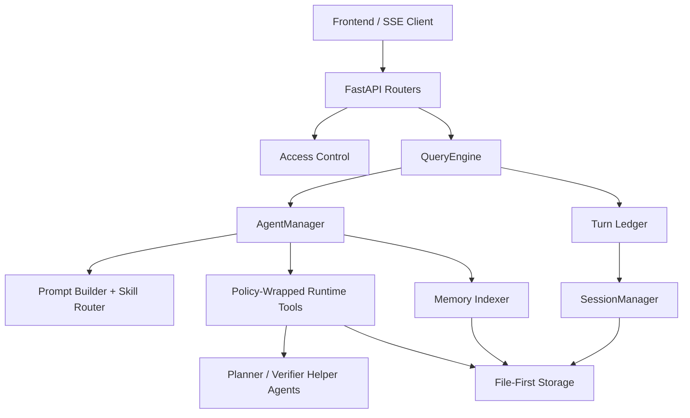

# BioAPEX Backend Architecture Design

Date: 2026-04-03

## Purpose

This document explains the current BioAPEX backend design in a way that is suitable for an architecture walkthrough with a group leader. It is based on the code currently wired through the backend entrypoint and runtime modules on this branch.

## Executive Summary

BioAPEX uses a thin FastAPI service layer on top of an engine-first agent runtime. The backend is designed around five ideas:

- thin HTTP routes and a central runtime boundary
- file-first persistence instead of hidden in-memory state
- explicit tool, retrieval, plan, and verification traces
- domain-aware skill and memory injection at turn time
- safety and hardening controls around execution and writes

In practice, the backend behaves less like a typical CRUD API and more like an inspectable scientific runtime: the API receives a request, the runtime decides how to answer it, the session ledger persists what happened, and durable files remain the long-term source of truth.

## Design Goals

- Keep the chat route transport-focused rather than embedding business logic in the API layer.
- Preserve scientific work as inspectable files: sessions, memory notes, artifacts, audit logs, and schemas.
- Support domain-specific biology workflows through runtime skill routing instead of hardcoded per-route logic.
- Make planning, verification, retrieval, and tool use visible to the frontend.
- Keep risky actions gated by access control, file whitelists, and tool policy metadata.

## Current Backend Surface

The backend entrypoint is [`backend/app.py`](../app.py). At startup it:

1. loads environment variables
2. configures embedding support when available
3. scans skills and regenerates `SKILLS_SNAPSHOT.md`
4. initializes the singleton `AgentManager`
5. rebuilds the memory index
6. registers the active API routers

The currently active routers are:

- `POST /api/chat`
- session routes under `/api/sessions`
- file and skill-registry routes under `/api/files`, `/api/skills`, and `/api/skills/registry`
- access probing under `/api/access/probe`

This small route surface is intentional: the backend pushes most decision-making down into runtime modules.

## High-Level Architecture

## Main Runtime Flow

### 1. Request Entry

The chat entrypoint is [`backend/api/chat.py`](../api/chat.py).

- enforces execution access
- validates `session_id` via `QueryEngine.validate_session_id`
- constructs a `QueryEngine` and returns an SSE `StreamingResponse` from
  `QueryEngine.stream_turn_sse`

The route does not own persistence or SSE payload assembly — those live in
`runtime.query_engine` and `runtime.turn_ledger`.

### 2. Turn Lifecycle Ownership

`QueryEngine.stream_turn_sse` in
[`backend/runtime/query_engine.py`](../runtime/query_engine.py) owns all
transport-facing turn concerns:

- auto-compresses long sessions before execution
- loads session history
- generates a per-turn `request_id` and monotonic `event_index`
- enters a tool policy context scoped to the turn
- serializes typed runtime events into SSE
- delegates persistence (accepted user message + assistant segments) to
  `TurnLedger`
- emits the final `done` (or `error`) event

This keeps session persistence and stream formatting in one place behind the
runtime boundary.

### 3. Turn Orchestration

`QueryEngine.run_turn` / `QueryEngine.run_harness_turn` own the internal
execution loop:

- drives a `TurnLedger` as the authoritative accumulator of assistant segments
- forwards ordinary events from the agent runtime
- translates helper-agent tool results into first-class events:
  - `plan_created`
  - `plan_updated`
  - `verification_result`
- supports one bounded repair retry when verification fails or requests repair
- finalizes the turn into persisted assistant segments

This is the main control boundary of the backend.

### 4. Agent Construction and Prompt Assembly

`AgentManager` in [`backend/graph/agent.py`](../graph/agent.py) is the singleton runtime owner. It initializes:

- role-specific LLM clients
- the runtime tool set
- the `SessionManager`
- the `MemoryIndexer`

For each turn it rebuilds the agent instead of reusing a cached one. That design choice is deliberate: live edits to skills, memory, workspace instructions, or prompt context are reflected immediately in the next request.

Prompt construction in [`backend/graph/prompt_builder.py`](../graph/prompt_builder.py) assembles:

- selected skill snapshot content
- workspace identity files
- project instruction files such as `AGENTS.md`
- optional git context
- either retrieved memory snippets or the static `memory/MEMORY.md`

### 5. Skill Routing and Memory Retrieval

Two modules make the runtime domain-aware without hardcoding behavior into the API:

- [`backend/graph/skill_router.py`](../graph/skill_router.py)
  - picks a small relevant subset of skills per turn
  - scores by names, aliases, tags, modality, stage, and path hints
- [`backend/graph/memory_indexer.py`](../graph/memory_indexer.py)
  - indexes memory documents under `memory/`
  - splits markdown into section-level retrieval units
  - returns source-aware memory snippets

This lets the runtime stay general while still behaving like a biologist-facing system.

### 6. Tool Execution

Runtime tools are created in [`backend/tools/__init__.py`](../tools/__init__.py). They include:

- environment tools such as terminal and Python REPL
- read/write file tools
- knowledge and web retrieval tools
- biology-facing evidence and grounding tools
- helper-agent tools for planning and verification

Every runtime tool is wrapped by policy metadata from:

- [`backend/tools/registry.py`](../tools/registry.py)
- [`backend/tools/policy.py`](../tools/policy.py)
- [`backend/tools/policy_wrappers.py`](../tools/policy_wrappers.py)

This gives each tool an explicit contract:

- access scope
- read-only vs destructive behavior
- planner/verifier exposure
- interrupt behavior
- evidence expectations
- output contract version

The tool result contract in [`backend/tools/contracts.py`](../tools/contracts.py) normalizes all tool outputs into a structured envelope so the frontend and session store can treat tools consistently.

### 7. Planning and Verification as Helper Agents

Planning and verification are not handled by separate routes. They are helper-agent tools:

- [`backend/tools/plan_agent_tool.py`](../tools/plan_agent_tool.py)
- [`backend/tools/verification_agent_tool.py`](../tools/verification_agent_tool.py)
- [`backend/runtime/helper_agent_runner.py`](../runtime/helper_agent_runner.py)

The planner can inspect with a limited tool subset and return a structured execution plan.

The verifier can inspect the draft answer and return a verdict:

- `pass`
- `repair_required`
- `fail`

`QueryEngine` upgrades these tool outputs into top-level runtime events so they appear as native process artifacts rather than opaque tool blobs.

## Persistence Model

The backend is intentionally file-first.

### Session Storage

`SessionManager` in [`backend/graph/session_manager.py`](../graph/session_manager.py) stores each chat session as JSON under `backend/sessions/`.

Key behaviors:

- session files use a versioned schema
- assistant messages can contain additive typed `blocks`
- old messages can be auto-compressed into structured continuity summaries
- archived message batches are stored separately under `sessions/archive/`

The session model is designed to preserve both human-readable conversation text and machine-usable process traces.

### Continuity Compression

When a session grows large, the backend summarizes older history using [`backend/graph/session_summary.py`](../graph/session_summary.py).

The summary format preserves:

- decisions and rationale
- results
- evidence references
- compliance information
- open questions and next actions

This keeps long scientific conversations usable without losing traceability.

### Long-Term Memory

The memory system is separate from sessions:

- human- or runtime-curated notes live under `backend/memory/`
- the memory index is persisted under `backend/storage/memory_index/`
- retrieved memory is treated as background context, not as current-turn verified truth

This is important architecturally: session history and long-term memory are different concerns.

### Durable Scientific Artifacts

The artifact system under `backend/artifacts/` defines a canonical layout for run outputs such as:

- evidence cards
- compliance reports
- provenance bundles
- workflow run records
- BioCompute exports

The artifact naming standard is documented in [`backend/artifacts/README.md`](../artifacts/README.md). The design goal is reproducibility: meaningful outputs should exist as files with schemas, not only as chat text.

## Safety, Hardening, and Governance

### Access Control

Route-level access control is centralized in [`backend/access_control.py`](../access_control.py).

It supports:

- loopback access for local development
- bearer-token access for inspection, execution, and admin scopes
- proxy-aware loopback hardening through forwarded-header checks

### API and Tool Hardening

Production hardening settings are defined in:

- [`backend/hardening.py`](../hardening.py)
- [`backend/config.py`](../config.py)

These govern things like:

- whether loopback bypass is allowed
- whether file writes are enabled
- whether terminal or REPL tools are enabled
- allowed CORS origins

### File Safety

The file API in [`backend/api/files.py`](../api/files.py) enforces:

- path whitelist rules
- project-root containment
- secret-like path blocking
- write-size limits
- memory-file validation rules

This is important because the system intentionally exposes file inspection and editing.

### Auditability

The backend includes append-only audit helpers in [`backend/audit/store.py`](../audit/store.py) and compliance-specific audit logging in [`backend/compliance/audit.py`](../compliance/audit.py).

Today, audit events are clearly used for:

- file writes
- compliance decisions
- exports
- job submissions

The codebase also includes structured observability storage in [`backend/observability/store.py`](../observability/store.py). That layer exists as a backend capability, although it is currently more of a prepared subsystem than a central live dependency of the chat path.

## Directory-Level Design

The backend is organized by responsibility:

| Area | Responsibility |
| --- | --- |
| `api/` | HTTP contract and request validation |
| `runtime/` | turn lifecycle, helper-agent orchestration, streaming runtime logic |
| `graph/` | agent construction, prompt building, sessions, memory, skill routing |
| `tools/` | runtime tool implementations and tool contracts |
| `skills/` | domain-specific behavior encoded as skill documents |
| `memory/` | long-term memory notes |
| `knowledge/` | static project/domain reference material |
| `evidence/`, `compliance/`, `checklists/` | scientific reasoning and safety subsystems |
| `artifacts/` | schema-backed durable output formats |
| `audit/`, `observability/` | append-only operational records |
| `storage/` | derived indexes and runtime storage |
| `tests/` | backend regression coverage |

## Core Design Decisions

### 1. Thin Routes, Thick Runtime

The API layer validates and transports. The runtime decides.

Why:

- easier to test behavior without HTTP scaffolding
- cleaner separation between transport and orchestration
- safer future expansion of streaming and helper-agent behavior

### 2. Rebuild the Agent Per Turn

The agent is recreated every request instead of being kept as a long-lived static object.

Why:

- workspace instruction changes take effect immediately
- skill registry changes are picked up without restart
- prompt context stays tied to repo truth

Trade-off:

- slightly more setup work per turn

### 3. File-First Persistence Over Database-First Design

Sessions, memory, artifacts, and logs are all inspectable on disk.

Why:

- easier reproducibility
- easier debugging
- better fit for scientific workflows where provenance matters

Trade-off:

- less centralized query power than a database-backed architecture

### 4. Additive Contracts Instead of Opaque Transcripts

Sessions now carry typed blocks for retrievals, tool calls, plans, and verification artifacts.

Why:

- frontend can render process truthfully
- old text content remains readable
- new runtime structure can be added without breaking every consumer

### 5. Bounded Helper-Agent Loop

Planning and verification are allowed, but the runtime only performs one automatic repair retry.

Why:

- improves answer quality
- avoids unbounded autonomous loops
- keeps the system inspectable and predictable

## Known Trade-Offs and Current Limits

- The backend is intentionally optimized for transparency and inspectability rather than maximum throughput.
- The route surface is currently focused on chat, files, sessions, and access; some other backend capabilities exist more as reusable modules than as first-class public APIs.
- Audit support is meaningfully present, but not every possible runtime action is yet uniformly emitted into one central trace stream.
- Observability storage is implemented, but not yet the main operational reporting path for ordinary chat turns.
- File-first storage makes the system easy to inspect, but eventually high-scale usage may require stronger indexing or database support around the same contracts.

## How To Explain This To A Group Leader

One concise way to present the design is:

> The BioAPEX backend is an engine-first scientific runtime behind a thin FastAPI layer. The API accepts requests and streams results, but the real work happens in a central runtime that assembles project context, routes to relevant biology skills, retrieves memory, executes policy-wrapped tools, and persists the whole turn as structured session data. We chose a file-first design so sessions, memory, artifacts, and audit data remain inspectable and reproducible rather than hidden inside transient agent state.

## Suggested Talking Points

- The architecture is centered on traceability, not just answer generation.
- Sessions are durable scientific records, not only chat logs.
- Planning and verification are built into the runtime, but in a bounded and inspectable way.
- Memory and skills are runtime-selectable, so the assistant can adapt per task without exploding prompt size.
- Safety is enforced at multiple layers: route access, tool policy, file restrictions, and compliance subsystems.
- The backend is set up to support real scientific artifacts and workflows, not only conversational responses.
